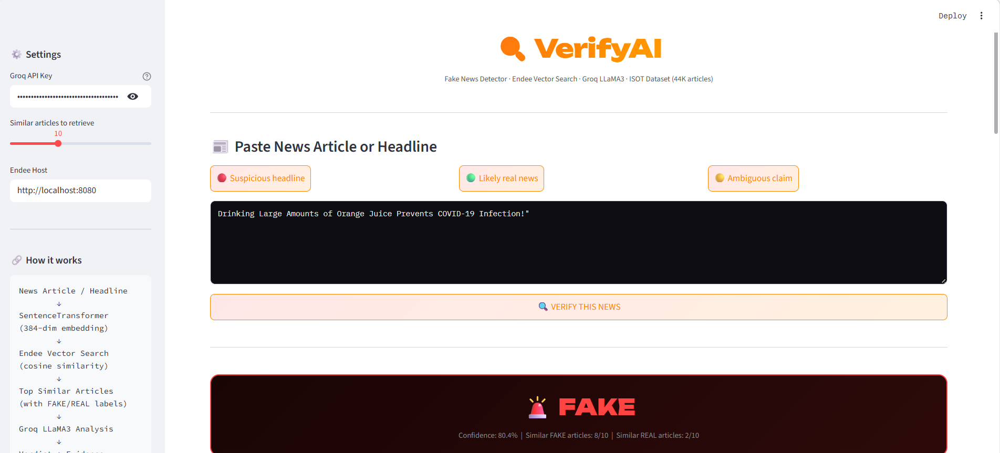
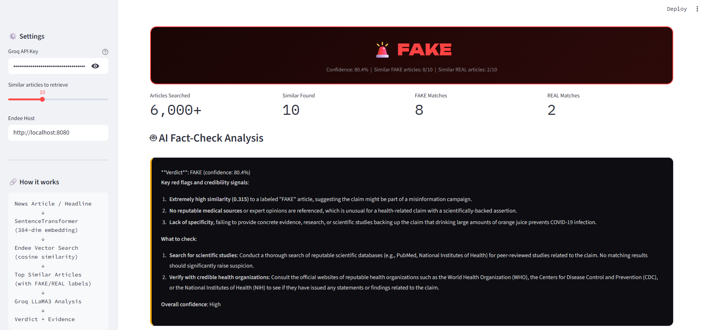
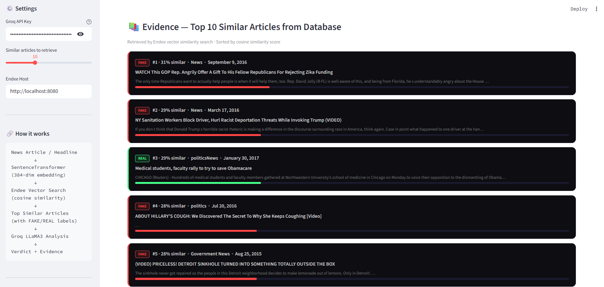
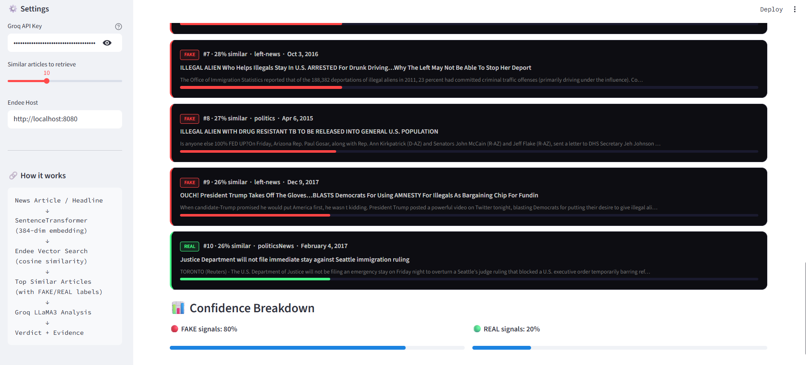

# 🔍 VerifyAI — Fake News Detector using Endee Vector Database

> Paste any news article or headline → Endee semantically searches 6,000+ labeled articles → Groq LLaMA3 delivers a verdict with evidence and red flags.


---

## 📌 Problem Statement

Misinformation spreads faster than truth. Fact-checking manually is slow and requires expertise. Keyword-based search misses semantically similar fake articles that use different wording.

**VerifyAI solves this** using **semantic vector search** via Endee — when you paste a news article, it finds the most similar articles from a labeled dataset of 44,000 real and fake news articles. The ratio of fake vs real matches, weighted by similarity scores, determines the verdict.

---

## 📸 Screenshots

### Verdict


### AI Analysis


### Evidence 1


### Evidence 2

---

## 🏗️ System Design

```
┌──────────────────────────────────────────────────────────────┐
│                    INDEXING PIPELINE                          │
│                                                               │
│  ISOT Dataset                                                 │
│  Fake.csv (23,481 articles) + True.csv (21,417 articles)     │
│       │                                                       │
│       ▼                                                       │
│  Text Preparation                                             │
│  title + first 400 chars of body                             │
│       │                                                       │
│       ▼                                                       │
│  SentenceTransformer (all-MiniLM-L6-v2)                      │
│  384-dimensional embeddings                                   │
│       │                                                       │
│       ▼                                                       │
│  Endee Vector DB                                              │
│  (cosine similarity, INT8, ~6000 articles indexed)           │
└──────────────────────────────────────────────────────────────┘

┌──────────────────────────────────────────────────────────────┐
│                   VERIFICATION PIPELINE                       │
│                                                               │
│  User pastes news article / headline                         │
│       │                                                       │
│       ▼                                                       │
│  SentenceTransformer → 384-dim embedding                     │
│       │                                                       │
│       ▼                                                       │
│  Endee.query(top_k=10)                                        │
│  Finds 10 most semantically similar articles                 │
│       │                                                       │
│       ▼                                                       │
│  Weighted Verdict Computation                                 │
│  fake_score vs real_score (weighted by similarity)           │
│       │                                                       │
│       ▼                                                       │
│  Groq LLaMA3 — Red flags, verification steps, confidence     │
│       │                                                       │
│       ▼                                                       │
│  UI: FAKE/REAL/UNCERTAIN + Evidence Cards + Confidence Meter │
└──────────────────────────────────────────────────────────────┘
```

---

## 🔑 How Endee Vector Database is Used

Endee is the **core detection engine** — not just storage:

| Operation | Endee API | Purpose |
|---|---|---|
| Create index | `client.create_index(name, dimension=384, space_type="cosine", precision=INT8)` | Cosine similarity index with INT8 quantisation for fast semantic search |
| Index articles | `index.upsert([{id, vector, meta}])` | Stores embeddings with label (FAKE/REAL), title, text, subject, date |
| Semantic search | `index.query(vector=article_vec, top_k=10)` | Finds 10 most similar articles to input in milliseconds |
| Weighted verdict | similarity scores from results | FAKE/REAL ratio weighted by cosine scores determines verdict |

**Key insight:** Articles that are semantically similar to known fake news will cluster together in vector space. Endee exploits this clustering to detect misinformation patterns without needing explicit rules.

---

## ✨ Features

- 📰 **Paste any article or headline** — works with full articles or just titles
- 🔍 **Semantic search** — finds similar articles by meaning, not keywords
- 🚨 **FAKE / ✅ REAL / ⚠️ UNCERTAIN** verdict with confidence score
- 📚 **Evidence cards** — shows top similar articles with their labels
- 📊 **Confidence meter** — visual breakdown of fake vs real signals
- 🤖 **AI analysis** — Groq identifies red flags and verification steps
- 💡 **Sample headlines** — built-in test cases to try immediately
- 🗃️ **44,000 article dataset** — ISOT Fake News Dataset from University of Victoria

---

## 📁 Project Structure

```
fake-news-detector/
├── docker-compose.yml    # Spins up Endee vector DB
├── ingest_news.py        # Loads ISOT dataset → indexes into Endee
├── app_news.py           # Streamlit web UI
├── requirements.txt      # Python dependencies
├── data/                 # ← Put Fake.csv and True.csv here
│   ├── Fake.csv
│   └── True.csv
└── screenshots/          # App screenshots
```

---

## 🚀 Setup & Running

### Prerequisites
- Python 3.10+
- Docker & Docker Compose
- ISOT Dataset → [Download from Kaggle](https://www.kaggle.com/datasets/clmentbisaillon/fake-and-real-news-dataset)
- Free Groq API key → [console.groq.com](https://console.groq.com)

### Step 1 — Clone repo & install dependencies

```bash
git clone https://github.com/ivishaltiwari123-glitch/fake-news-detector
cd fake-news-detector
pip install -r requirements.txt
```

### Step 2 — Add dataset

```bash
mkdir data
# Copy Fake.csv and True.csv into the data/ folder
```

### Step 3 — Start Endee vector DB

```bash
docker compose up -d
# Dashboard at http://localhost:8080
```

### Step 4 — Index articles into Endee

```bash
python ingest_news.py
# Indexes 3000 fake + 3000 real articles = 6000 total
# Takes ~3-5 minutes
```

To index more articles:
```bash
python ingest_news.py --limit 10000
```

Expected output:
```
📂 Loading datasets …
   Fake articles available: 23481
   True articles available: 21417
   ✅ Total articles to index: 6000
🔌 Connecting to Endee vector DB …
   ✅ Index 'news_articles' created (dim=384, cosine, INT8)
🤖 Loading embedding model …
⚡ Generating embeddings for 6000 articles …
📤 Uploading to Endee in batches of 256 …
✅ Done! Indexed 6000 articles into Endee.
```

### Step 5 — Launch the app

```bash
python -m streamlit run app_news.py
# Open http://localhost:8501
```

### Step 6 — Verify news

1. Paste Groq API key in sidebar
2. Paste any headline or article
3. Click **VERIFY THIS NEWS**
4. See verdict + evidence + AI analysis!

---

## 🧪 Example

**Input:** *"BREAKING: Scientists confirm that drinking bleach cures all diseases, government hiding the truth"*

**Output:**
```
🚨 FAKE
Confidence: 78.3%
Similar FAKE articles: 8/10  |  Similar REAL articles: 2/10
```

**AI Analysis:**
> Red flags: Sensationalist language ("BREAKING"), conspiracy framing ("government hiding"),
> unverifiable medical claim. Similar articles in database are predominantly fabricated
> political misinformation. Recommend checking CDC, WHO, and peer-reviewed sources.

---

## 🛠️ Tech Stack

| Component | Technology |
|---|---|
| Vector Database | **Endee** (self-hosted, open-source) |
| Dataset | **ISOT Fake News Dataset** (44K articles, University of Victoria) |
| Embeddings | **sentence-transformers** `all-MiniLM-L6-v2` (384-dim) |
| LLM Analysis | **Groq LLaMA3-8B** (ultra-fast inference) |
| Web UI | **Streamlit** |
| Containerisation | **Docker Compose** |

---

## 🔧 Configuration

| Parameter | File | Default | Description |
|---|---|---|---|
| `DEFAULT_LIMIT` | `ingest_news.py` | 3000 | Articles per class to index |
| `TOP_K` | `app_news.py` | 10 | Similar articles to retrieve |
| `GROQ_MODEL` | `app_news.py` | `llama-3.1-8b-instant` | LLM model |
| `ENDEE_HOST` | Both files | `http://localhost:8080` | Endee server URL |

---

## 📄 License

MIT © 2026 — Vishal Tiwari
